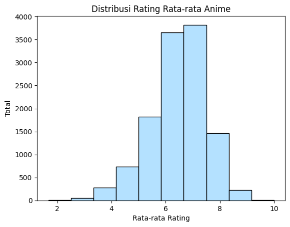
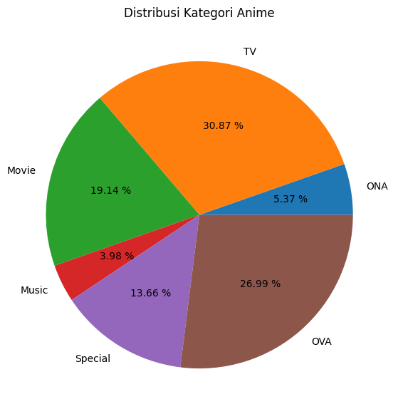
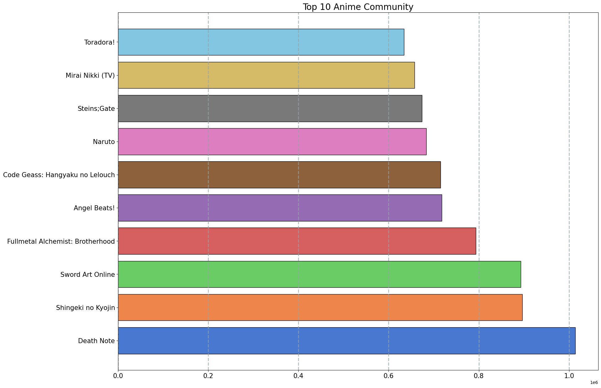
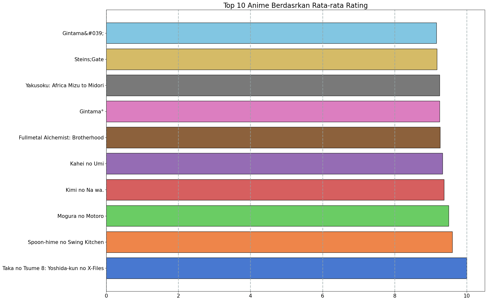
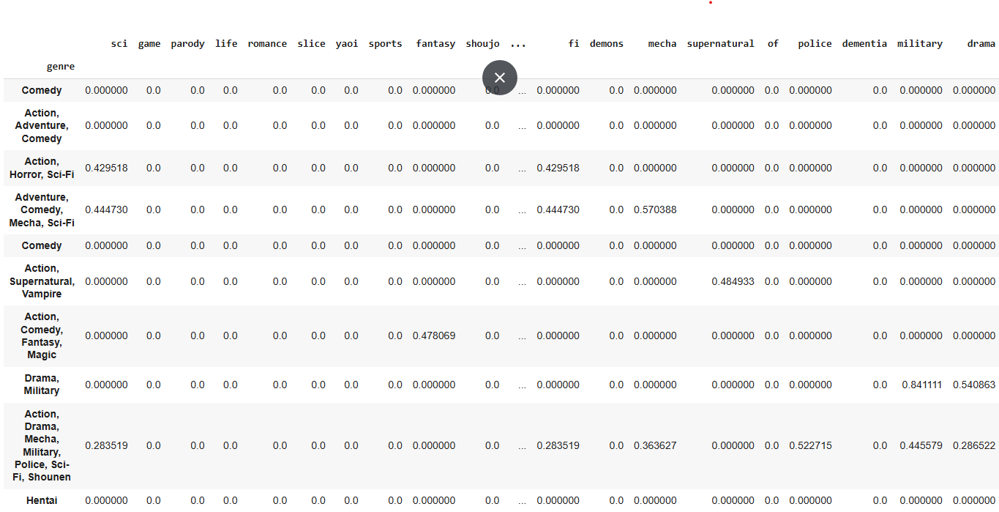
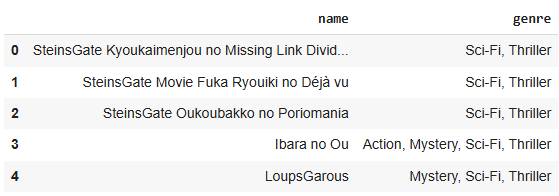

# Sistem Rekomendasi Anime

#### Oleh : Putri Nur Fadillah

Proyek ini adalah proyek akhir untuk memenuhi submission Machine Learning Terapan yang bertujuan untuk membangun model sistem rekomendasi berbasis _Content-Based Filtering_ dan K-Nearest Neighbor (K-NN). Model ini dirancang untuk memberikan Top-N rekomendasi anime kepada pengguna berdasarkan kesamaan preferensi mereka.

## Project Overview


Anime merupakan animasi yang berasal dari negara Jepang yang digambar dengan tangan maupun menggunakan teknologi komputer. Di luar Jepang, istilah ini digunakan secara spesifik untuk menyebutkan segala animasi yang diproduksi di Jepang. Popularitas anime berkembang pesat secara global, dengan platform streaming seperti **Crunchyroll**, **Funimation**, dan **Netflix** mengalami pertumbuhan signifikan. Menurut laporan Statista (2024), pasar streaming anime diperkirakan akan mencapai **$30 miliar pada tahun 2030** dengan tingkat pertumbuhan tahunan (CAGR) sebesar **9,6%**.

Dengan banyaknya pilihan anime yang tersedia, pengguna sering kesulitan menemukan konten yang sesuai dengan preferensi mereka. Hal ini dapat disebabkan oleh keterbatasan deskripsi dan ulasan pengguna. Oleh karena itu, sistem rekomendasi diperlukan untuk membantu pengguna menemukan anime yang relevan.

## Business Understanding

Proyek ini bertujuan untuk mengembangkan Sistem Rekomendasi Anime menggunakan pendekatan Content-Based Filtering dan K-Nearest Neighbor (K-NN) untuk menghasilkan rekomendasi anime yang relevan dan personal berdasarkan preferensi pengguna.

## Problem Statements

1. Bagaimana cara membantu pengguna menemukan anime yang relevan dengan preferensi mereka di tengah ribuan pilihan yang tersedia?
2. Bagaimana membangun model sistem rekomendasi menggunakan Cosine Similarity dan K-Nearest Neighbor (K-NN)?
3. Bagaimana cara mengukur performa model sistem rekomendasi yang telah dibangun?

## Goals

Untuk menjawab permasalahan yang telah diidentifikasi, Anime Sistem Rekomendasi dirancang dengan tujuan berikut:

1. Menghasilkan rekomendasi anime berupa Top-N rekomendasi untuk pengguna.
2. Membangun model sistem rekomendasi berbasis Cosine Similarity untuk menghitung tingkat kesamaan antar item dan K-Nearest Neighbor (K-NN) untuk menemukan item yang paling mirip.
3. Mengukur performa model sistem rekomendasi menggunakan metrik evaluasi seperti Calinski Harabasz Score dan Davies Bouldin Score.

## Solution Approach

1. Melakukan analisis data menggukan univariate dan multivariate analysis serta melakuakan visualisasi.
2. Melakukan pembersihan data seperti menghapus missing value, pemeriksaaan data duplikat agar didapatkan model prediksi yang baik.
3. Mengukut performa model sistem rekomendasi menggunakan Calinski Harabasz Score dan Davies Bouldin Score.

# Data Understanding

## EDA-Deskripsi Variabel

| Jenis      | Keterangan                                                                           |
| ---------- | ------------------------------------------------------------------------------------ |
| Title      | Anime Recommendations Database                                                       |
| Source     | [Kaggle](https://www.kaggle.com/datasets/CooperUnion/anime-recommendations-database) |
| License    | CC0: Public Domain                                                                   |
| Visibility | Publik                                                                               |
| Tags       | _Movie and TV Shows, Anime and Manga, Comics and Animation, Popular Culture_         |

**Informasi Dataset**
_Dataset_ ini berisi informasi mengenai data preferensi pengguna dari 73.516 pengguna terhadap 12.294 anime. Setiap pengguna dapat menambahkan anime ke daftar lengkap mereka dan memberinya peringkat dan kumpulan data ini adalah kompilasi dari peringkat tersebut. Pada \_dataset ini terdapat 2 file csv yaitu `Anime.csv` dan `Rating.csv`.

pada file `Anime.csv` diketahui bahwa :

- _Dataset_ memiliki 12294 sample dengan 7 fitur.
- _Dataset_ memiliki 4 kolom dengan tipe object yaitu kolom `name`, `genre`, `type`, dan `episodes`.2 kolom dengan tipe int64 yaitu kolom `anime_id` dan `members`. Serta 1 kolom dengan tipe float64 yaitu rating.
- Terdapat _missing value_ pada kolom `genre` berjumlah 62, `type` berjumlah 25 serta `rating` yang berjumlah 230.
- Tidak terdapat data duplikat pada _dataset_

**Variable - variable pada Dataset**
Kolom dataset `anime.csv` memiliki informasi sebagai berikut:

- `anime_id	`: id unik myanimelist.net yang mengidentifikasi sebuah anime
- `name`: nama lengkap anime
- `genre`: daftar genre anime yang dipisahkan koma
- `type`: tipe anime seperti film, TV, OVA, dll
- `episodes`: jumlah episode anime (jika film jumlah eps = 1)
- `rating`: peringkat anime
- `members`: jumlah anggota komunitas


Berdasarkan Gambar 1, dapat kita ketahui bahwa mayoritas anime memiliki rating rata-rata di kisaran 6 hingga 8, dengan puncak distribusi berada di sekitar 7.


Berdasarkan Gambar 2, animasi dengan format durasi panjang atau serial (TV dan OVA) mendominasi dengan proporsi sebesar 30.87% dan 26.99%.


Dari Gambar 3, menampilkan hasil 10 peringkat teratas anime yang memiliki jumlah anggota komunitas terbanyak diketahui bahwa anime dengan judul Death Note memiliki jumlah anggota kominitas terbanyak.


Berdasarkan Gambar 4, dapat diketahui bahwa anime Taka no Tsume 8 Yoshidakun no XFiles menempati urutan teratas dalam kategori anime yang memiliki rata-rata rating tertinggi.

# Data Preparation

Pada tahap _data preparation_ dilakukan 3 proses utama, yaitu:

1. Penanganan _missing value_
   Pada tahap ini, dilakukan pengecekan _missing value_ dan terdapat _missing value_ pada kolom `genre` dengan jumlah 62, `type` berjumlah 25, serta `rating` yang berjumlah 230. Untuk menangani _missing value_ ini dilakukan dengan metode `dropna()` karena, data yang dihapus tidak mempengaruhi model. Sehingga jumlah _dataset_ yang awalnya berjumlah 12294 menjadi 11917.
2. Pembersihan simbol pada judul anime (_text cleaning_)
   pada tahap _text cleaning_ dilakukan penghapusan simbol-simbol yang tidak relevan dengan membuat sebuah function `text*cleaning*. Proses _text cleaning_ ini dilakukan dengan bantuan _library_ Regex (re).
*function* `text_clening` ini bertujuan untuk melakukan pembersihan teks, khussunya judul anime (`name`), dengan menghapus simbol-simbol atau karakter yang tidak diinginkan serta menyederhakan teks agar lebih terstruktur dan mudah diproses.
3. Penghapusan kolom yang tidak diperlukan
   Proses penghapusan kolom `anime_id`, `episodes`, dan `members` dilakukan karena kolom-kolom tersebut tidak relevan untuk analisis atau prediksi yang diinginkan pada proyek ini.
4. TF-IDF Vectorizer
  TF-IDF akan mentransformasikan teks menjadi representasi angka yang memiliki makna tertentu dalam bentuk matriks. Adapun hasil TF-IDF dapaat dilihat pada Gambar 5
  

  hasil TF-IDF pada Gambar 5 menunjukkan hubungan antara nama anime terhadap kategori yang dipilih. Matriks ini menunjukkan seberapa besar korelasi antara anime terhadap kategori yang dipilih.

Pada proses pembangunan sistem rekomendasi dalam proyek ini, atribut yang digunakan meliputi `name`, `genre`, `rating`, dan `type`. Untuk pembuatan model dengan pendekatan Content-Based Filtering, data yang diperlukan adalah nama anime (`name`) dan genre anime (`genre`). Selain itu, dilakukan one-hot encoding pada fitur `type` dan `rating` untuk mengubah variabel kategorikal menjadi bentuk numerik sehingga lebih mudah diproses oleh model pembelajaran mesin.

# Model Development

Pada proyek ini, hanya akan digunakan Model Cosine Similarity dan K-Nearest Neighbor. Kedua algoritma tersebut bertujuan untuk mempelajari tingkat kesamaan antar data berdasarkan fitur yang tersedia. Sebelum melakukan model development, dilakuakn ekstraksi fitur menggunakan `TF-IDF`.

## Cosine Similarity

Cosine Similarity adalah sebuah metode yang digunakan untuk mengukur seberapa mirip dua vektor dalam ruang vektor. Ukuran ini dihitung dengan menghitung sudut antara dua vektor, di mana dua vektor yang lebih mirip memiliki sudut yang lebih kecil, dan sebaliknya. Cosine Similarity sering digunakan dalam analisis teks untuk mengukur kesamaan antar dokumen.

**Rumus Cosine Similarity**

Rumus untuk menghitung Cosine Similarity antara dua vektor **A** dan **B** adalah sebagai berikut:

$$Cosine Similarity (A, B) = (A · B) / (||A|| * ||B||)$$

dimana:

- (A·B)menyatakan produk titik dari vektor A dan B.
- ||A|| mewakili norma Euclidean (magnitudo) dari vektor A.
- ||B|| mewakili norma Euclidean (magnitudo) dari vektor B.
  untuk melakukan pengujian model, digunakan potongan kode berikut.

```python
anime_recommendations('SteinsGate')
```


Berdasarkan Gambar 6, Sistem berhasil merekomendasikan top 5 persen anime yang mirip dengan SteinsGate, yaitu beberapa seri dan film dari SteinsGate itu sendiri. Jadi, jika pengguna menyukai SteinsGate, maka sistem dapat merekomendasikan seri atau movie SteinsGate lainnya.

**Kelebihan Cosine Similarity**

- Tidak terpengaruh oleh panjang vektor, hanya mengukur arah.
- Sederhana dan cepat dihitung.
- Efektif untuk data sparse (jarang).
- Tidak terpengaruh oleh skala fitur.

**Kekurangan Cosine Similarity**

- Tidak memperhitungkan informasi magnitudo (panjang vektor).
- Hanya mengukur arah, tidak sensitif terhadap variasi fitur.
- Rentan terhadap fitur dominan.
- Tidak dapat menangani hubungan non-linier antar data.

## K-Nearest Neighbor

K-Nearest Neighbors (K-NN) adalah algoritma pembelajaran mesin yang digunakan untuk klasifikasi dan regresi. Dalam K-NN, data yang ingin diprediksi dikategorikan berdasarkan mayoritas label dari _K_ tetangga terdekatnya di ruang fitur. Untuk menentukan tetangga terdekat, biasanya digunakan jarak antara data titik dengan data lainnya. Salah satu metrik jarak yang sering digunakan adalah _Euclidean Distance_.

**Rumus Euclidean Distance**

$$Euclidean Distance (P, Q) = sqrt(∑(Pi - Qi)^2)$$

dimana:

- Pi mewakili fitur ke-i dari titik data P.
- Qi mewakili fitur ke-i dari titik data Q (titik data dari kumpulan data D).
- ∑ merupakan simbol penjumlahan pada semua fitur titik data.

**Kelebihan K-NN**

- Sederhana dan mudah dipahami
- Tidak memerlukan pelatihan model
- Fleksibel dan dapat menangani masalah multikelas
- **Kekurangan K-NN**
- performa menurun pada Data besar
- Sensitif terhadap dimensi tinggi
- Membutuhkan banyak memori
- Memerluka normalisasi data

Berikut adalah hasil pengujian model K-NN dengan metrik Euclidean Distencr.
Apabila pengguna menyukai anime dengan judul:Bakemono no Ko
Berikut rekomendasi anime yang mungkin akan disukai :


Berdasarkan Gambar 7. Hasil Pengujian Model K-NN, kita dapat melihat bahwa model K-Nearest Neighbor memberikan rekomendasi Anime berdasarkan kemiripan fitur-fitur seperti 'Name', 'Score', dan 'Type'. Hasil rekomendasi untuk Anime yang mirip dengan Bakemono no Ko berdasarkan berdasarkan fitur-fitur yang dipelajari memberikan hasil rekomendasi anime serupa yaitu: Hotaru no Haka, Bakemono no Ko, Gintama Movie Shinyaku Benizakurahen, Kara no Kyoukai 7 Satsujin Kousatsu Kou , dan Gintama Yorinuki Gintamasan on Theater 2D. Seperti yang terlihat pada Gambar 7. Hasil Pengujian Model K-Nearest Neighbor dengan tingkat kemiripan dalam persentase berturut-turut senilai 100.0%, 100.0%, 99.99%, 99.99%, 99.98% . Tentunya model ini akan sangat membantu pengguna menemukan anime yang mirip dengan Bakemono no Ko.

# Evaluasi Model

Metrik evaluasi digunakan untuk mengukur sejauh mana sebuah model mampu bekerja secara efektif dalam menyelesaikan tugas yang diberikan. Pada proyek ini, metrik evaluasi yang digunakan adalah Precission, Calinski-Harabasz Score dan Davies-Bouldin Score. Metrik-metrik ini dirancang untuk memberikan wawasan mengenai performa model, baik dalam tugas klasifikasi yang mengukur akurasi prediksi, maupun dalam klastering data yang menilai kualitas pemisahan antar kelompok. Dengan menggunakan metrik evaluasi ini, kita dapat menilai secara objektif seberapa baik model dalam menghasilkan output yang diinginkan sesuai dengan tujuan analisis.

## Precission

Precision dalam matriks evaluasi adalah metrik yang digunakan untuk mengukur akurasi prediksi positif dari sebuah model. Precision menghitung seberapa banyak prediksi positif yang benar dibandingkan dengan total prediksi positif yang dibuat model.

_Precission_ dituliskan dalam rumus:

$$Presisi = \frac{TP}{TP + FP}$$

dimana:

- TP (True Positive): Jumlah data yang diprediksi positif dan memang benar-benar positif.
- FP (False Positive): Jumlah data yang diprediksi positif, namun kenyataannya adalah negatif.

Pada Gambar 6 menujukkan hasil top 5 rekomendasi anime. Semua hasil rekomendasi sistem relevan dengan genre anime. Untuk itu presisi model rekomendasi Top-5, yaitu 3/5 atau 60%. Dengan nilai precision, model mampu memberikan rekomendasi yang sesuai dengan nama dan genre yan mirip dengan anime `SteinsGate` yang memiliki genre _Sci-Fi_ dan _Thriller_.

## Calinski-Harabasz score

Clinski-Harabasz Score (juga dikenal sebagai Variance Ratio Criterion) adalah salah satu metrik evaluasi dalam analisis klaster (clustering). Metrik ini digunakan untuk menilai kualitas hasil klaster yang dihasilkan oleh algoritma clustering seperti k-means, hierarchical clustering, atau lainnya. Metrik ini mengukur seberapa baik klaster yang terbentuk terpisah satu sama lain dan seberapa homogen setiap klaster. Semakin tinggi nilai CH Score, semakin baik kualitas pemisahan dan homogenitas klaster yang terbentuk.

**Rumus**

Calinski-Harabasz Score dihitung menggunakan rumus berikut:

$$CH = \frac{B}{W} \times \frac{N - k}{k - 1}$$

Di mana:

- \( B \) adalah sebaran antar cluster (between-cluster scatter).
- \( W \) adalah sebaran dalam cluster (within-cluster scatter).
- \( N \) adalah jumlah total data.
- \( k \) adalah jumlah cluster.

Nilai Calinski-Harabasz Score yang lebih tinggi menunjukkan bahwa klaster yang terbentuk lebih terpisah dengan lebih sedikit variasi dalam setiap klaster, yang menandakan hasil klasterisasi yang lebih baik.

Untuk melakukan pengujian model, digunakan potongan kode berikut.

```
ch_score = calinski_harabasz_score(new_data, anime_name)
```

dan didapatkan skor sebagai berikut

```
Calinski-Harabasz Score: 5.0031370256340795
```

Hasil evaluasi model menggunakan Calinski-Harabasz Score berada di angka 5.0031370256340795. Angka ini tergolong rendah yang menunjukan bahwa kluster dalam model ini masih belum terpisah dengan baik. Hal ini mengindikasikan adanya potensi untuk rekomendai yang kurang sesuai dengan prederensi pengguna. Oleh karena itu, perlu dilakukan penijauan lebih lanjut atau penyesuaian pada model untuk meningkatkan akurasi dan pemisahan kluster.

## Davies Bouldin Score

Davies-Bouldin Score adalah metrik evaluasi yang digunakan untuk menilai kualitas hasil clustering dalam analisis data. Metrik ini mengukur seberapa baik suatu klaster terpisah satu sama lain, dengan memperhitungkan jarak antar klaster dan keberagaman dalam klaster.

Nilai DB Score dihitung berdasarkan dua faktor utama:

1. **Kepadatan Klaster**: Mengukur sejauh mana data dalam klaster tersebut tersebar.
2. **Jarak antar Klaster**: Mengukur jarak antara pusat klaster yang berbeda.

Semakin kecil DB Score, semakin baik pemisahan antar klaster, yang berarti klaster-klaster tersebut lebih padat dan lebih terpisah.

**Rumus**

Rumus untuk menghitung Davies-Bouldin Score adalah:

$$DB = \frac{1}{k} \sum_{i=1}^{k} \max_{j \neq i} \left( \frac{R_i + R_j}{d(c_i, c_j)} \right)$$

Di mana:
- \( k \) adalah jumlah cluster.
- \( R_i \) adalah radius dalam cluster ke-i.
- \( d(c_i, c_j) \) adalah jarak antara pusat cluster ke-i (\( c_i \)) dan pusat cluster ke-j (\( c_j \)).

Untuk melakukan pengujian model, digunakan potongan kode berikut.

```
db_score = davies_bouldin_score(new_data, anime_name)
```

dan didapatkan skor sebagai berikut

```
Davies-Bouldin Score: 1.7266309883660804
```

Nilai 1.7266 ini relatif tinggi, yang menunjukkan bahwa klaster-klaster yang dihasilkan tidak terlalu terpisah dengan jelas atau ada beberapa klaster yang mungkin tumpang tindih satu sama lain. Metrik ini mengindikasikan adanya overlap antar klaster, atau klaster-klaster tersebut mungkin tidak cukup kompak (terlalu tersebar), yang menyebabkan klaster saling mendekat atau bahkan bertumpuk. Namun, dalam hal memberikan rekomendasi anime yang baik pada sistem rekomendasi. Hal ini karena Davies-Bouldin Score memberikan gambaran tentang kualitas pemisahan antar klaster, sistem rekomendasi tidak selalu bergantung sepenuhnya pada pemisahan klaster yang sangat jelas.

# Kesimpulan

Setelah proses pembangunan sistem rekomendasi anime selesai, dapat disimpulkan bahwa:

1. Sistem rekomendasi berhasil menghasilakn rekomendasi berupa Top-5 anime berdasarkan preferensi pengguna.
2. Cosine Similarity memberikan hasil rekomendasi yang relevan, dengan presisi mencapai 60% untuk rekomendasi Top-5. Metode ini sangat cocok untuk data yang berbasis teks dan menghasilkan hasil yang cukup baik dalam proyek ini.
3. K-NN mampu memberikan rekomendasi berdasarkan kesamaan fitur dengan tingkat kemiripan yang tinggi. Namun, metode ini cenderung sensitif terhadap dimensi data yang besar.
4. Hasil evaluasi model menggunakan Calinski-Harabasz Score menunjukkan hasil yang rendah yaitu `5.00311 yang menunjukkan klaster dalam model belum optimal terpisah, mengindikasikan kebutuhan untuk penyesuaian model atau penambahan fitur.
5. Hasil evaluasi model dengan Davies-Bouldin Score (1.7266) yang relatif tinggi juga menunjukkan bahwa klasterisasi model dapat ditingkatkan untuk pemisahan yang lebih baik.

Dengan begitu, sistem rekomendai anime yang telah dibangun telah memebrikan hasil yang cukup menjanjikan untuk membantu pengguna menemukan anime berdasarkan preferensi mereka. Namun, masih ada yang perlu diperbaiki, terutama dalam evaluasi klaster dan optimasi model agar dapat memberikan rekomendasi yang lebih akurat.

# Referensi

1. Statista (2024). Anime Streaming Market Growth Analysis.
2. Davies, D.L., & Bouldin, D.W. (1979). "A Cluster Separation Measure". IEEE Transactions on Pattern Analysis and Machine Intelligence. https://doi.org/10.1109/TPAMI.1979.4766909.
3. Jain, A.K. (2010). "Data Clustering: 50 Years Beyond K-Means". Pattern Recognition Letters. https://doi.org/10.1016/j.patrec.2009.09.011.
4. Ricci, F., Rokach, L., & Shapira, B. (2015). Recommender Systems Handbook. Springer.
